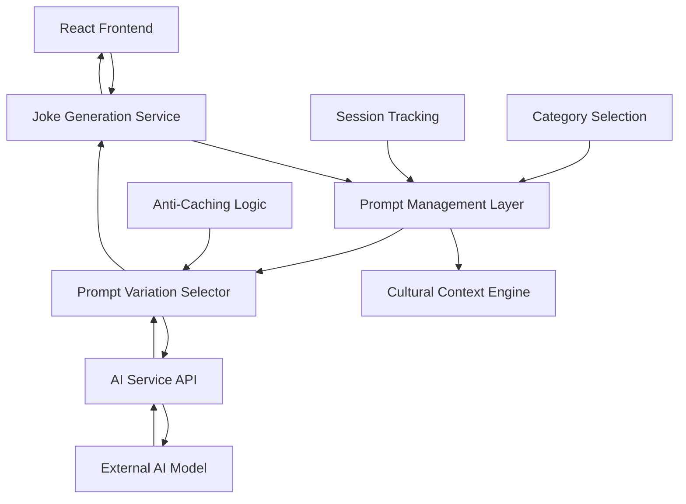

# Design Document: Indian Jokes Localization

## Overview

This design enhances the existing React-based jokes generation system by integrating Indian cultural context and localized humor patterns. The enhancement maintains the current architecture while introducing culturally relevant prompt variations that resonate with Indian audiences through familiar references, situations, and language patterns.

The system will leverage research-backed understanding of Indian humor characteristics including self-deprecating wit, cultural references to Bollywood, cricket, family dynamics, and everyday struggles, while maintaining appropriate content standards for both family-friendly and adult categories.

## Architecture

### Current System Architecture
The existing system follows a client-server architecture:
- **Frontend**: React application with category selection and joke display
- **Backend**: Express.js API server with AI integration
- **AI Service**: External AI model for content generation
- **State Management**: React hooks for joke history and UI state

### Enhanced Architecture
The enhancement preserves the existing architecture while introducing:
- **Prompt Management Layer**: Centralized prompt variation system with Indian cultural context
- **Cultural Context Engine**: Logic for selecting appropriate cultural references
- **Localization Service**: Handles Indian English patterns and cultural adaptation



## Components and Interfaces

### 1. Enhanced Prompt Management System

**PromptVariationManager**
```typescript
interface PromptVariationManager {
  generatePrompt(category: 'family' | 'spicy', sessionData: SessionData): string;
  getVariations(category: string): string[];
  validateCulturalContent(prompt: string): boolean;
}

interface SessionData {
  sessionId: string;
  randomSeed: string;
  timestamp: number;
}
```

**Cultural Context Integration**
- Family-friendly prompts incorporate: school life, parents, teachers, Bollywood movies, cricket, traffic, festivals, office culture, trains, exams, weddings, mobile phones, family WhatsApp groups, power cuts, street food
- Adult prompts include: politics, work pressure, relationships, court cases, bureaucracy, social habits, elections, job interviews, social media behavior

### 2. Prompt Variation System

**Family-Friendly Variations (5 templates)**
1. Daily life situations with Indian context
2. Educational and family scenarios
3. Entertainment and cultural references  
4. Technology and modern Indian life
5. Traditional and festival contexts

**Adult Variations (5 templates)**
1. Political and social commentary
2. Workplace and professional scenarios
3. Relationship and social dynamics
4. Bureaucratic and system humor
5. Contemporary social issues

### 3. Language and Cultural Adaptation

**Indian English Patterns**
- Simple vocabulary accessible to diverse English proficiency levels
- Natural conversational tone reflecting Indian speech patterns
- Cultural idioms and expressions familiar to Indian audiences
- Avoidance of complex or overly formal language structures

**Content Safety Framework**
- Family category: Completely clean, all-ages appropriate
- Adult category: Bold but respectful, avoiding hate speech or offensive stereotypes
- Cultural sensitivity: Respectful representation without negative stereotyping
- Community guidelines: Inclusive humor that brings people together

## Data Models

### Enhanced Prompt Configuration
```typescript
interface PromptConfig {
  category: 'family' | 'spicy';
  variations: PromptVariation[];
  culturalElements: CulturalElement[];
  safetyGuidelines: SafetyRule[];
}

interface PromptVariation {
  id: string;
  template: string;
  culturalReferences: string[];
  languageStyle: 'simple' | 'conversational' | 'witty';
  targetAudience: string;
}

interface CulturalElement {
  category: string;
  references: string[];
  appropriateFor: ('family' | 'spicy')[];
  description: string;
}

interface SafetyRule {
  category: string;
  restrictions: string[];
  guidelines: string[];
}
```

### Session Management Enhancement
```typescript
interface EnhancedSessionData extends SessionData {
  culturalPreferences?: string[];
  previousCulturalReferences: string[];
  jokeQualityMetrics: QualityMetric[];
}

interface QualityMetric {
  culturalRelevance: number;
  humorEffectiveness: number;
  languageAppropriatenessScore: number;
}
```

## Correctness Properties

*A property is a characteristic or behavior that should hold true across all valid executions of a system—essentially, a formal statement about what the system should do. Properties serve as the bridge between human-readable specifications and machine-verifiable correctness guarantees.*

Based on the prework analysis and property reflection, the following properties ensure the Indian jokes localization system maintains correctness while delivering culturally relevant content:

### Property 1: Cultural Reference Inclusion
*For any* joke generation request (family or adult category), the selected prompt should contain at least one culturally relevant Indian reference appropriate for that category (family: school, parents, teachers, movies, cricket, traffic, festivals, office life, trains, exams, weddings, mobile phones, family WhatsApp groups, power cuts, street food; adult: politics, work pressure, relationships, court cases, bureaucracy, social habits)
**Validates: Requirements 1.1, 1.2, 1.4**

### Property 2: Language Simplicity and Indian English Patterns
*For any* generated prompt with Indian context, the language should maintain simple vocabulary, avoid complex words, use natural conversational tone, and follow Indian English patterns that are easily understood by diverse proficiency levels
**Validates: Requirements 1.3, 1.5, 3.3**

### Property 3: Prompt Variation Randomness
*For any* sequence of joke generation requests, the system should select different prompt variations across multiple requests to ensure diversity and prevent repetitive content
**Validates: Requirements 2.3**

### Property 4: Session Tracking Variable Inclusion
*For any* generated prompt, it should contain session tracking variables (sessionId, randomSeed, timestamp) to prevent caching and ensure unique content generation
**Validates: Requirements 2.4**

### Property 5: Output Format Purity
*For any* joke generation response, the output should contain only the joke text without additional formatting, explanatory content, or metadata
**Validates: Requirements 3.5**

### Property 6: Backward Compatibility Preservation
*For any* existing functionality (joke generation workflow, API integration patterns, error handling), the enhanced system should maintain the same behavior and interface contracts as the original implementation
**Validates: Requirements 4.2, 4.4, 4.5**

## Error Handling

### Cultural Content Validation
- **Invalid Cultural References**: If prompts fail to include appropriate cultural elements, fallback to generic Indian context templates
- **Language Complexity Detection**: If generated prompts exceed complexity thresholds, trigger simplification process
- **Cultural Sensitivity Violations**: Implement content filtering to prevent inappropriate cultural representations

### Prompt Generation Failures
- **Variation Exhaustion**: If all prompt variations have been recently used, reset selection pool with randomization
- **Session Tracking Errors**: If session variables fail to generate, use fallback timestamp-based tracking
- **Template Corruption**: Maintain backup prompt templates for each category

### Integration Error Handling
- **API Compatibility Issues**: Preserve existing error response formats and status codes
- **Backward Compatibility Breaks**: Implement feature flags to rollback to original prompts if needed
- **Performance Degradation**: Monitor prompt generation time and fallback to simpler templates if needed

## Testing Strategy

### Dual Testing Approach
The system requires both unit testing and property-based testing to ensure comprehensive coverage:

**Unit Tests** focus on:
- Specific examples of cultural reference inclusion
- Edge cases in prompt template selection
- Error conditions and fallback behaviors
- Integration points with existing joke generation system
- Specific examples of Indian cultural elements in generated prompts

**Property-Based Tests** focus on:
- Universal properties that hold across all prompt generations
- Comprehensive input coverage through randomization of categories, session data, and cultural contexts
- Validation of language patterns across diverse prompt variations
- Consistency of cultural reference inclusion across large sample sizes

### Property-Based Testing Configuration
- **Testing Framework**: Use fast-check for JavaScript/TypeScript property-based testing
- **Test Iterations**: Minimum 100 iterations per property test to ensure statistical significance
- **Test Tagging**: Each property test must reference its design document property using the format: **Feature: indian-jokes-localization, Property {number}: {property_text}**

### Testing Implementation Requirements
- Each correctness property must be implemented by a single property-based test
- Property tests should generate random session data, categories, and cultural contexts
- Unit tests should complement property tests by testing specific cultural reference examples
- Integration tests should verify backward compatibility with existing joke generation workflow
- Performance tests should ensure prompt generation doesn't significantly impact response times

### Test Data Generation
- **Cultural Reference Generators**: Create generators for Indian cultural elements across different categories
- **Language Pattern Validators**: Implement complexity analyzers for Indian English patterns  
- **Session Data Generators**: Generate realistic session tracking variables for testing
- **Prompt Template Validators**: Verify prompt structure and cultural element inclusion
- **Backward Compatibility Checkers**: Ensure existing functionality remains unchanged